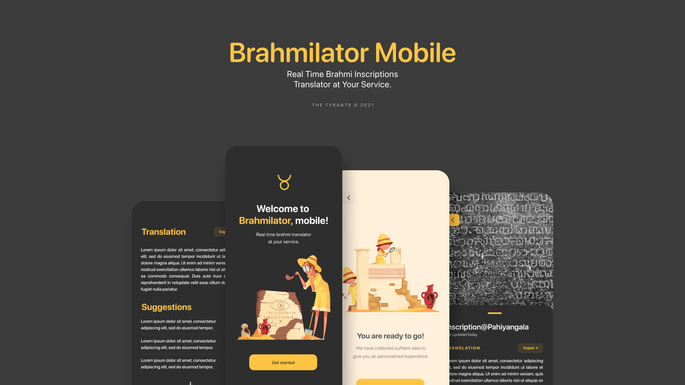

# Brahmilator - Systematic approach to translate Early Brahmi Inscriptions

This project aims to provide a systematic solution to recognize the characters in ancient Sri Lankan inscriptions and translate them into Sinhala and other native languages. Proposed system has 5 different core modules. 

01. Pre - Processing Module 
02. Character Segmentating Module
03. Classification Module
04. Words Generating Module
05. Translating Module

## Prerequisites
- React-Native
- Python 3.7
- Tensorflow
- MongoDB
- OpenCV

## How to run the Project

01. Clone the project by `git clone https://github.com/ManojLL/Brahmilator.git`
02. Install all the mentioned dependecies by running `npm install`
in root folder of the client-side component `brahmi_frontend/tyrants`
03. Configuration between OpenCV and React-Native is mentioned on the brahmi_frontend [README.md](https://github.com/ManojLL/Brahmilator/blob/master/brahmi_frontend/tyrants/README.md)

## Resources

In order to get a clear understading of the project you can refer following links.
- [Project Structure](https://github.com/ManojLL/Brahmilator/wiki/Project-Structure)
- [Project Overview](https://github.com/ManojLL/Brahmilator/wiki/Project-Overview)

## License

[MIT](https://github.com/ManojLL/Brahmilator/blob/master/LICENSE.md)

---

